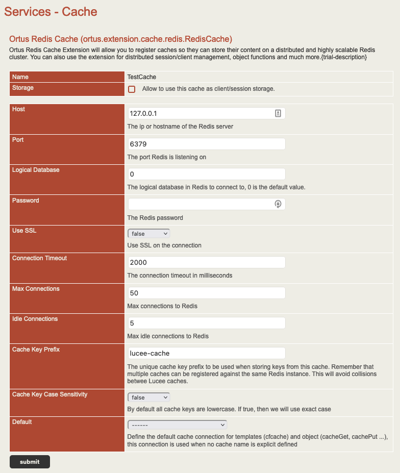

# Pub/Sub

## What is Pub/Sub?



We have introduced the capability for your CFML code to now leverage Redis Publish and Subscribe constructs.  This will allow your CFML code to have native messaging via Redis.


Documentation


> Redis Pub/Sub implement the Publish/Subscribe messaging paradigm. This decoupling of publishers and subscribers can allow for greater scalability and a more dynamic network topology.

1. Subscribers express interest in one or more channels (literal channels or pattern channels).
2. Publishers send messages into channels.
3. Redis will push these messages into different subscribers which have matched the channel's message.

## Pub/Sub Functions

In order to leverage this pattern you will use the following two functions:

| Function                                            | Description                                                                                                                  |
| --------------------------------------------------- | ---------------------------------------------------------------------------------------------------------------------------- |
| `RedisPublish( channel, message, cacheName )`       | Publish a message into redis into a specific channel. Returns how many subscribers are listening to the message and channel. |
| `RedisSubscribe( subscriber, channels, cacheName )` | Subscribe to a channel for messages using a closure/lambda or a listener CFC.  Returns a `future` and a `subscriber.`        |


Pattern publishing and subscriptions are still not developed yet.


### Publish Example

```javascript
// Publish Example
<h2>Publishing messages...</h2>
<cfflush>
<cfscript>
	RedisPublish( "test-channel", "Hola mi amigo" );
	RedisPublish( "test-channel", "Hola mi amigo2" );
	RedisPublish( "test-channel", "Hola mi amigo Redis" );
</cfscript>
<h2>Finished publishing messages</h2>
```

The return of the `redisPublish()` function is a numeric indicating how many subscribers received the message.

### Subscribe Example

```javascript
<cfscript>
// Subscribe with closure
closureSubscriber = redisSubscribe( ( channel, message ) => {
	writeDump( var="Message received on channel #arguments.channel#, #arguments.message#", output="console" );
}, "test-channel" );

// Subscribe with CFC
cfcSubscriber = redisSubscribe( new Subscriber(), "test-channel" );

</cfscript>
<h1>Subscription started!! Check the logs!</h1>
```

The `redisSubscribe()` function returns a struct with two keys in it:

* `future` - A completable future that is running your subscriber on.
* `subscriber` - The Java Redis subscriber object you can use to inspect the subscription or unsubscribe from the calls via the `unsubscribe()` method.

### Subscriber Listener CFC

If you will be passing a CFC to the `redisSubscribe()` methods then you will need to implement some or all of the following functions.

```javascript
component {

	public void function onMessage( String channel, String message ) {
		writeDump( var="Subscriber CFC -> onMessage called :#arguments.toString()#", output="console" );
	}

	public void function onPMessage( String pattern, String channel, String message ) {
		writeDump( var="Subscriber CFC -> onPMessage called :#arguments.toString()#", output="console" );
	}

	public void function onSubscribe( String channel, numeric subscribedChannels ) {
		writeDump( var="Subscriber CFC -> onSubscribe called :#arguments.toString()#", output="console" );
	}

	public void function onUnsubscribe( String channel, numeric subscribedChannels ) {
		writeDump( var="Subscriber CFC -> onUnsubscribe called :#arguments.toString()#", output="console" );
	}

	public void function onPUnsubscribe( String pattern, numeric subscribedChannels ) {
		writeDump( var="Subscriber CFC -> onPUnsubscribe called :#arguments.toString()#", output="console" );
	}

	public void function onPSubscribe( String pattern, numeric subscribedChannels ) {
		writeDump( var="Subscriber CFC -> onPSubscribe called :#arguments.toString()#", output="console" );
	}

}
```
